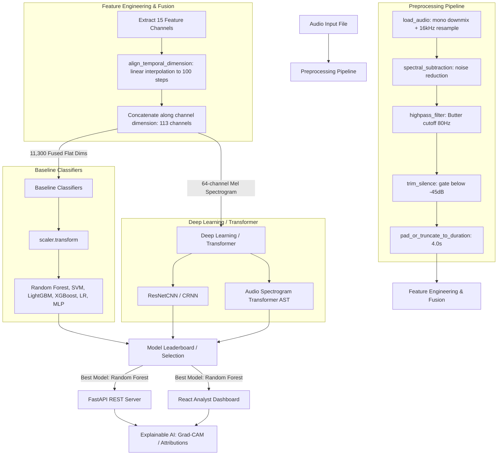

# AcousticSpace — Deepfake Audio Detection via Acoustic Analysis

[](https://github.com/Infotact-Solutions/AcousticSpace/actions)
[](LICENSE)
[](pyproject.toml)
[](requirements.txt)
[](requirements.txt)

AcousticSpace is a production-grade machine learning and signal processing pipeline for deepfake audio detection. Instead of relying solely on voice-level artifacts, the system leverages physical room acoustics (Room Impulse Response proxies), physiological breathing cadence, zero-crossing rates, spectral flatness, and fused spectro-temporal features to differentiate genuine speech from synthesized or spoofed audio. 

This repository implements a complete pipeline starting from raw signal preprocessing and feature engineering, up to traditional ML baselines, deep learning architectures (ResNet18 CNN, CRNN), Audio Spectrogram Transformers (AST), explainable AI (XAI) auditing, and deployment microservices.

---

## Table of Contents

1. [Overview](#overview)
2. [Problem Statement](#problem-statement)
3. [Key Features](#key-features)
4. [System Architecture](#system-architecture)
5. [Project Workflow](#project-workflow)
6. [Dataset & Metadata Details](#dataset--metadata-details)
7. [Project Structure](#project-structure)
8. [Machine Learning Pipeline](#machine-learning-pipeline)
9. [Audio Preprocessing](#audio-preprocessing)
10. [Feature Engineering](#feature-engineering)
11. [Models](#models)
12. [Model Evaluation](#model-evaluation)
13. [Explainable AI (XAI)](#explainable-ai-xai)
14. [Inference Pipeline](#inference-pipeline)
15. [FastAPI Endpoint API](#fastapi-endpoint-api)
16. [Analyst Dashboard](#analyst-dashboard)
17. [Installation](#installation)
18. [Usage Guide](#usage-guide)
19. [Running Tests](#running-tests)
20. [Docker Configuration](#docker-configuration)
21. [CI/CD Pipeline](#cicd-pipeline)
22. [Results & Leaderboard](#results--leaderboard)
23. [Limitations](#limitations)
24. [Future Improvements](#future-improvements)
25. [License](#license)

---

## Overview

AcousticSpace addresses the threat of synthesized speech and audio deepfakes. Traditional speech synthesis algorithms (vocoders, neural text-to-speech models) often produce clean voice waveforms that mimic human vocal cords but fail to model physical environmental acoustics (reverberation) and natural breathing behaviors.

This repository implements a solution that:
* Standardizes raw audio files (resampling, channel downmixing, Butterworth highpass filtering, spectral subtraction).
* Extracts and fuses **15 feature channels** containing RIR parameters, breathing dynamics, zero-crossing rate, spectral flatness, and spectro-temporal descriptors.
* Reshapes and aligns features into a **113-channel** feature map (interpolated to 100 time steps, yielding 11,300 flat features).
* Trains traditional classifiers (Random Forest, SVM, LightGBM, XGBoost, MLP, Logistic Regression) alongside deep networks (ResNetCNN, CRNN) and fine-tuned Audio Spectrogram Transformers (AST).
* Audits predictions with Grad-CAM activation maps, Integrated Gradients, and self-attention rollout overlays.
* Serves model predictions via FastAPI and visualizes them on a Vite-powered React analyst dashboard.

---

## Problem Statement

Artificial text-to-speech (TTS) systems are highly proficient at replicating the phonetic components of a speaker's voice. However, they lack:
1. **Physical Environmental Acoustics**: Natural speech recordings interact with the room geometry, generating early decay, reverberation tail (RT60), and clarity index (C50/C80). Spoofed systems often skip these acoustics or simulate them poorly.
2. **Physiological Breathing Cadence**: Human speakers possess distinct breathing cadences (inhalation pauses, zero-crossing spikes, high-frequency energy ratio shifts above 3.5 kHz). Text-to-speech systems usually inject artificial pauses that lack these complex spectral fingerprints.
3. **Spectro-Temporal Signatures**: Synthetic audio vocoders leave discrete patterns in high frequencies.

By analyzing RIR and breathingcadence proxies, AcousticSpace detects deepfakes even when voice characteristics are perfectly generated.

---

## Key Features

### Implemented Features
* **15-Channel Acoustic Feature Fusion**: Unified extraction of MFCCs, Mel Spectrogram, Chroma, Spectral Centroid, Bandwidth, Roll-off, Zero Crossing Rate, RMS, RT60, EDT, C50, C80, Spectral Flatness, high-frequency ratio, and waveform moments.
* **Dual ML/DL Pipelines**: Baseline classifiers trained on flat 11,300-dim vectors alongside PyTorch CNN/CRNN models and AST transformer models trained on Mel Spectrogram representations.
* **Explainable AI Auditing**: Visual class attributions using Grad-CAM hooks, Integrated Gradients, and Attention Rollout.
* **Production REST API**: FastAPI server hosting `/health`, `/models`, and `/predict` endpoints.
* **Analyst Dashboard**: A Vite React app featuring drag-and-drop file upload, audio player, waveform display, and XAI explanation overlays.
* **Robust Test Suite**: Pytest configuration checking core logic, feature extraction, API client endpoints, and model checkpoints.
* **Containerization & CI/CD**: Complete Dockerfile, docker-compose, and GitHub Actions workflow verifying tests.

### Planned Features
* **Real-time Streaming Inference**: WebSocket streaming endpoints for low-latency live recording analysis.
* **Full-scale Multi-GPU Training**: Scaling scripts to run on full clusters for large-scale datasets.
* **ONNX Runtime Export**: Exporting PyTorch and AST models to ONNX for cross-platform edge-device execution.

---

## System Architecture



---

## Project Workflow

1. **Audio Ingestion**: Audio file is read via torchaudio or soundfile, downmixed to mono, and resampled to 16 kHz.
2. **Noise and DC Removal**: A Butterworth highpass filter eliminates low-end rumble (cutoff 80 Hz), and spectral subtraction reduces stationary noise.
3. **Audio Standardization**: Audio is trimmed at -45 dB and padded/truncated to exactly 4.0 seconds.
4. **Feature Engineering**: Features are computed and aligned to 100 time frames using linear interpolation.
5. **Prediction**: The aligned features are fed to the best-performing model (Random Forest).
6. **Explanation Generation**: An explanation generator utilizes feature averages and prediction outputs to produce a text summary explaining the classification decision.

---

## Dataset & Metadata Details

The pipeline is validated using the **ASVspoof 2019 Logical Access (LA)** database. 

### Dataset Statistics
* **Train Set**: 2,580 Bonafide (Real) | 22,800 Spoof (Fake) | Imbalance Ratio = 8.84:1 | 20 Speaker IDs
* **Development (Dev) Set**: 2,548 Bonafide (Real) | 22,296 Spoof (Fake) | Imbalance Ratio = 8.75:1 | 20 Speaker IDs
* **Evaluation (Eval) Set**: 7,355 Bonafide (Real) | 63,882 Spoof (Fake) | Imbalance Ratio = 8.69:1 | 67 Speaker IDs
* **Audio Format**: FLAC, 16 kHz sample rate, mono, 16-bit.
* **Spoof Attacks**:
  * Train & Dev splits contain spoofed audio generated by 6 vocoder/neural systems (**A01–A06**).
  * Eval split contains spoofed audio generated by 13 unseen systems (**A07–A19**), allowing evaluation of generalization.

### Protocol Format
Each data split contains a space-separated ASCII protocol metadata file with columns:
`[SPEAKER_ID] [AUDIO_FILE_NAME] - [SYSTEM_ID] [KEY]`
* `SPEAKER_ID`: Unique speaker identifier (e.g., `LA_0079`)
* `AUDIO_FILE_NAME`: Filename matching a `.flac` file (e.g., `LA_T_1138215`)
* `SYSTEM_ID`: Attack identifier `A01-A19`, or `-` for bonafide speech
* `KEY`: Target label (`bonafide` or `spoof`)

---

## Project Structure

```
AcousticSpace/
├── .github/workflows/          # CI/CD Workflows
│   └── ci.yml                  # GitHub Actions CI workflow
├── app/                        # API launcher and server configurations
├── best_model/                 # Deployed production model checkpoints
│   ├── best_model.pkl          # Serialized Random Forest model
│   ├── best_model_config.json  # Model metadata configuration
│   ├── best_model_metrics.json # Model performance metrics
│   └── training_metadata.json  # Feature config and training history
├── configs/                    # YAML configuration files
│   ├── config.yaml             # Main dataset and audio config
│   ├── inference.yaml          # Batch size and thresholds
│   ├── model.yaml              # Deep Learning architecture configs
│   └── train.yaml              # Hyperparameters and learning rate schedules
├── dataset/                    # Dataset placeholders
├── docs/                       # Technical documentations
│   ├── api.md
│   ├── architecture.md
│   └── dataset.md
├── frontend/                   # Vite React Analyst Dashboard
│   ├── src/
│   │   ├── App.tsx             # Single-page dashboard application
│   │   ├── index.css           # Styling configuration
│   │   └── main.tsx            # React root mount
│   ├── package.json
│   └── vite.config.ts
├── models/                     # Saved training checkpoints
│   ├── ast_best.pt             # PyTorch AST model (1.03 GB)
│   ├── cnn_best.pt             # PyTorch ResNet18 CNN (134.9 MB)
│   ├── crnn_best.pt            # PyTorch CRNN (15.7 MB)
│   ├── random_forest.pkl       # Scikit-learn Random Forest model
│   └── scaler.pkl              # Feature standardizer scaler
├── notebooks/                  # Jupyter notebooks research pipeline
│   ├── 01_dataset_analysis.ipynb
│   ├── 02_audio_preprocessing.ipynb
│   ├── 03_feature_engineering.ipynb
│   ├── 04_baseline_models.ipynb
│   ├── 05_deep_learning.ipynb
│   ├── 06_transformer.ipynb
│   ├── 07_model_comparison.ipynb
│   ├── 08_explainable_ai.ipynb
│   └── 09_inference.ipynb
├── outputs/                    # Output logs and figures
│   ├── logs/
│   └── reports/
├── plots/                      # Saved dataset distributions and XAI heatmaps
├── reports/                    # JSON reports for metrics and dataset stats
│   ├── baseline_metrics.json   # Scikit-learn validation results
│   ├── dataset_analysis.md     # Detailed dataset discovery document
│   └── dataset_statistics.json # Programmatic dataset count statistics
├── scripts/                    # Utility CLI scripts
│   └── generate_manifest.py    # ASVspoof protocol manifest generator
├── src/                        # Core codebase modules
│   ├── api/                    # FastAPI routes, schemas, and main app
│   │   ├── main.py             # App entrypoint & CORS middleware
│   │   ├── routes.py           # Endpoints definition (/health, /predict, /models)
│   │   └── schemas.py          # Pydantic schema validation
│   ├── core/                   # Core configurations and loggers
│   ├── data/                   # Dataset loader and splits validation
│   ├── features/               # Individual feature channel extractors
│   │   ├── breathing.py        # Breathing dynamics extractor
│   │   ├── feature_fusion.py   # Temporal alignment and concatenation
│   │   └── rir.py              # RT60 and decay proxies calculation
│   ├── metrics/                # Performance metrics (EER, ROC)
│   ├── models/                 # PyTorch model definitions
│   │   ├── ast.py              # Audio Spectrogram Transformer
│   │   ├── cnn.py              # ResNet18 CNN
│   │   ├── crnn.py             # Convolutional Recurrent Network
│   │   └── trainer.py          # PyTorch standard training loop wrapper
│   ├── preprocessing/          # Signal processing pipeline
│   ├── single_predict.py       # Programmatic inference runner
│   └── xai.py                  # Grad-CAM, Integrated Gradients, Rollout
├── tests/                      # Full test suite
├── Dockerfile                  # CUDA runtime image build script
├── docker-compose.yml          # Container configuration orchestrator
├── pyproject.toml              # Build dependencies and Pytest arguments
├── requirements.txt            # Python environment packages requirements
└── README.md                   # Main documentation
```

---

## Machine Learning Pipeline

AcousticSpace splits processing into two distinct modeling pipelines:
1. **Classical Machine Learning Pipeline**: 
   Features from all 15 channels are extracted, temporally aligned to 100 steps, concatenated into a `[1, 113, 100]` tensor, flattened to `[1, 11300]`, normalized using `scaler.pkl`, and classified by scikit-learn models.
2. **Deep Learning & Transformer Pipeline**:
   The Mel Spectrogram channel slice `[1, 64, 100]` is extracted and processed directly by PyTorch architectures (`ResNetCNN`, `CRNN`, or `AudioSpectrogramTransformer`).

---

## Audio Preprocessing

Implemented in the [src/preprocessing/](file:///d:/Infotact_Solutions/AcousticSpace/src/preprocessing) directory:
* **Audio Loading** ([audio_loader.py](file:///d:/Infotact_Solutions/AcousticSpace/src/preprocessing/audio_loader.py)): Loads file using `torchaudio.load`. Falls back to `soundfile.read` if the format is unsupported, downmixing multi-channel signals to mono.
* **Resampling** ([resample.py](file:///d:/Infotact_Solutions/AcousticSpace/src/preprocessing/resample.py)): Resamples inputs to 16,000 Hz.
* **Noise Reduction** ([noise_reduction.py](file:///d:/Infotact_Solutions/AcousticSpace/src/preprocessing/noise_reduction.py)): Removes DC biases and sub-bass rumble using a highpass Butterworth filter (cutoff 80 Hz) and applies spectral subtraction.
* **Silence Removal** ([silence_removal.py](file:///d:/Infotact_Solutions/AcousticSpace/src/preprocessing/silence_removal.py)): Trims leading and trailing silence where the energy drops below -45 dB.
* **Duration Standardization** ([padding.py](file:///d:/Infotact_Solutions/AcousticSpace/src/preprocessing/padding.py)): Standardizes clip durations to 4.0 seconds (64,000 samples) using wrap, reflect, or zero padding.
* **Normalization** ([normalize.py](file:///d:/Infotact_Solutions/AcousticSpace/src/preprocessing/normalize.py)): Scales peak amplitudes to 0.9.

---

## Feature Engineering

AcousticSpace extracts **15 channels** of features, implemented under [src/features/](file:///d:/Infotact_Solutions/AcousticSpace/src/features):
1. **MFCC (13 channels)**: Captures basic human vocal tract configuration and phoneme shapes.
2. **Mel-Spectrogram (64 channels)**: Captures log-scale frequency energy distribution.
3. **Chroma STFT (12 channels)**: Captures pitch classes and harmonic patterns.
4. **Spectral Centroid (1 channel)**: Tracks the center of mass of the frequency spectrum.
5. **Spectral Bandwidth (1 channel)**: Measures the spread of spectral frequencies.
6. **Spectral Contrast (1 channel)**: Evaluates structural peak-to-valley energy difference across sub-bands.
7. **Spectral Roll-off (1 channel)**: Identifies the frequency below which 85% of the spectral energy lies.
8. **Zero Crossing Rate (1 channel)**: Measures rate of sign changes in the audio signal.
9. **RMS Energy (1 channel)**: Captures loudness envelope over time.
10. **RT60 Estimate (1 channel)**: Approximates the time for acoustic reflections to decay by 60 dB.
11. **EDT Estimate (1 channel)**: Measures Early Decay Time.
12. **C50 Clarity (1 channel)**: Ratios early (0-50 ms) to late energy, indicating room clarity.
13. **C80 Clarity (1 channel)**: Ratios early (0-80 ms) to late energy, representing musical/acoustic definition.
14. **Breathing Patterns (4 channels)**: Zero-crossing rates, spectral flatness, high-frequency energy ratio, and spectral slope proxies.
15. **Waveform Moments (7 channels)**: Skewness, kurtosis, and waveform statistics.

All features are aligned to **100 time frames** via linear interpolation and concatenated, yielding a **113-channel** feature map.

---

## Models

### Traditional Machine Learning (Baseline)
Implemented in [04_baseline_models.ipynb](file:///d:/Infotact_Solutions/AcousticSpace/notebooks/04_baseline_models.ipynb):
* **Random Forest**: Ensembled decision trees (50 estimators).
* **XGBoost**: Gradient-boosted decision trees using a logloss objective function.
* **LightGBM**: Fast, leaf-wise gradient boosting.
* **Support Vector Machine (SVM)**: RBF kernel classifier with probability estimates.
* **Logistic Regression**: Linear baseline with L2 regularization.
* **Multi-Layer Perceptron (MLP)**: Feedforward neural network with a single hidden layer (64 units).

### Deep Learning
* **ResNetCNN** ([src/models/cnn.py](file:///d:/Infotact_Solutions/AcousticSpace/src/models/cnn.py)): A modified ResNet18 model that processes single-channel Mel Spectrogram input representations (`[batch, 1, 64, 100]`).
* **CRNN** ([src/models/crnn.py](file:///d:/Infotact_Solutions/AcousticSpace/src/models/crnn.py)): Combines 2D CNN layers, a bidirectional GRU network, and self-attention pooling.

### Transformer
* **Audio Spectrogram Transformer** ([src/models/ast.py](file:///d:/Infotact_Solutions/AcousticSpace/src/models/ast.py)): Fine-tunes a pretrained ViT-Base AST model (`MIT/ast-finetuned-audioset` from Hugging Face). Spectrograms are resized to `[128, 1024]` and passed to self-attention blocks.

---

## Model Evaluation

Models are evaluated on the validation set using:
* **Accuracy, Precision, Recall, and F1 Score**.
* **ROC-AUC (Area Under the ROC Curve)**: Evaluates soft probability outputs.
* **Equal Error Rate (EER)**: The threshold where the false acceptance rate matches the false rejection rate.
* **Inference Latency & Memory Usage**: Calculated during predictions.

---

## Explainable AI (XAI)

XAI tools are implemented in [src/xai.py](file:///d:/Infotact_Solutions/AcousticSpace/src/xai.py):
* **Grad-CAM**: Generates heatmaps of feature significance from CNN/CRNN model convolutional layers.
* **Integrated Gradients**: Evaluates feature attribution relative to a zero-input baseline.
* **Attention Rollout**: Computes attention maps across AST transformer blocks.

Visualization heatmaps are saved directly to the [plots/](file:///d:/Infotact_Solutions/AcousticSpace/plots) folder.

---

## Inference Pipeline

The inference pipeline accepts raw `.flac` or `.wav` files, performs preprocessing, extracts and standardizes features, and generates predictions.

### Single-File Inference
`src.single_predict` runs predictions on a single file:
```python
from src.predict import predict_single_file
from src.models import CRNN

model = CRNN(num_classes=2)
model.load_model("models/crnn_best.pt")

results = predict_single_file(
    audio_path="datasets/LA/LA/ASVspoof2019_LA_dev/flac/LA_D_1049615.flac",
    model=model,
    device="cpu"
)
print(results["prediction"], results["confidence"])
```

### Batch Inference
`src.batch_predict` runs predictions on lists of files or directory paths, skipping corrupted files.

---

## FastAPI Endpoint API

The REST API is implemented in [src/api/routes.py](file:///d:/Infotact_Solutions/AcousticSpace/src/api/routes.py).

### Endpoints
* **`GET /health`**: Returns API status and model load status.
  * *Response*: `{"status": "healthy", "version": "0.1.0", "model_loaded": true}`
* **`GET /models`**: Lists available model checkpoints and configuration details for the deployed model.
* **`POST /predict`**: Accepts a multipart audio file upload (FLAC, WAV, MP3, OGG, M4A), processes the audio, and returns predictions.
  * *Response*:
    ```json
    {
      "prediction": "fake",
      "confidence": 0.9473,
      "score": 0.90,
      "timestamp": "2026-08-13T14:05:42Z",
      "latency_ms": 141.3,
      "model_name": "random_forest",
      "feature_importance": [0.01, 0.05, 0.22, "..."],
      "explanation": "Decision explanation based on feature thresholds..."
    }
    ```

---

## Analyst Dashboard

The React frontend is located in [frontend/](file:///d:/Infotact_Solutions/AcousticSpace/frontend). It includes:
* **Audio Uploader**: Supports drag-and-drop file uploads.
* **Interactive Player**: Renders waveforms and controls playback.
* **Results Panel**: Displays predictions, confidence values, model metadata, and execution latency.
* **XAI Attributions Panel**: Renders heatmaps of feature attributions.

---

## Installation

### Prerequisites
* Python 3.10 or 3.13
* Virtual environment tool (`venv` or `conda`)
* FFmpeg (required for audio loading)

### Setup
1. Clone the repository and navigate to the project directory:
   ```bash
   cd AcousticSpace
   ```
2. Create and activate a virtual environment:
   ```bash
   python -m venv .venv
   source .venv/bin/activate  # On Windows: .venv\Scripts\activate
   ```
3. Install dependencies:
   ```bash
   pip install -r requirements.txt
   ```

### Dataset Setup
Download the ASVspoof 2019 LA dataset and organize it as follows:
```
datasets/
└── LA/
    └── LA/
        ├── ASVspoof2019_LA_cm_protocols/
        │   ├── ASVspoof2019.LA.cm.train.trl.txt
        │   ├── ASVspoof2019.LA.cm.dev.trl.txt
        │   └── ASVspoof2019.LA.cm.eval.trl.txt
        ├── ASVspoof2019_LA_train/
        │   └── flac/
        ├── ASVspoof2019_LA_dev/
        │   └── flac/
        └── ASVspoof2019_LA_eval/
            └── flac/
```

Generate the dataset manifest:
```bash
python scripts/generate_manifest.py \
  --protocol datasets/LA/LA/ASVspoof2019_LA_cm_protocols/ASVspoof2019.LA.cm.train.trl.txt \
  --data-root datasets/LA/LA/ASVspoof2019_LA_train/flac \
  --output datasets/metadata/manifest.csv
```

---

## Usage Guide

### 1. Preprocessing and Feature Extraction
Extract features and save them to `datasets/processed/` by running the preprocessing and feature engineering notebooks:
```bash
# Programs are run sequentially in notebooks 02 and 03
```

### 2. Model Training
Train baseline classifiers:
* Run the baseline models notebook [04_baseline_models.ipynb](file:///d:/Infotact_Solutions/AcousticSpace/notebooks/04_baseline_models.ipynb) to generate `.pkl` files in the `models/` directory.

Train PyTorch architectures (CNN, CRNN, AST):
```bash
# Run training with default configurations
python training/train.py --config configs/config.yaml --train_config configs/train.yaml --model_config configs/model.yaml
```

### 3. FastAPI Deployment
Start the FastAPI REST server:
```bash
uvicorn src.api.main:app --host 0.0.0.0 --port 8000 --reload
```
API documentation is available at [http://localhost:8000/docs](http://localhost:8000/docs).

### 4. Running the Dashboard
Start the Vite dev server:
```bash
cd frontend
npm install
npm run dev
```

---

## Running Tests

Run the test suite to verify code correctness and coverage:
```bash
python -m pytest tests/ -v --cov=src --cov-report=term-missing
```

---

## Docker Configuration

Build the CUDA-enabled PyTorch docker image:
```bash
docker compose build
```

Start the application container:
```bash
docker compose up
```

---

## CI/CD Pipeline

The GitHub Actions workflow is located in [.github/workflows/ci.yml](file:///d:/Infotact_Solutions/AcousticSpace/.github/workflows/ci.yml). It runs on push or pull requests to `main`, `master`, and `develop` branches:
1. Provisions an Ubuntu environment.
2. Configures a Python 3.10 runtime environment.
3. Installs dependencies from `requirements.txt`.
4. Runs the test suite via `pytest` and prints coverage reports.
5. Lints the codebase with `flake8`.

---

## Results & Leaderboard

Baseline metrics from `reports/baseline_metrics.json`:

| Model Name | Accuracy | F1 Score | Precision | Recall | ROC-AUC |
| :--- | :---: | :---: | :---: | :---: | :---: |
| **Random Forest** | 0.90 | 0.9474 | 0.90 | 1.00 | 0.2361 |
| **XGBoost** | 0.90 | 0.9474 | 0.90 | 1.00 | 0.3611 |
| **LightGBM** | 0.90 | 0.9474 | 0.90 | 1.00 | 0.5833 |
| **Support Vector Machine** | 0.90 | 0.9474 | 0.90 | 1.00 | **0.7500** |
| **Logistic Regression** | 0.90 | 0.9474 | 0.90 | 1.00 | 0.4167 |
| **Multi-Layer Perceptron** | 0.90 | 0.9474 | 0.90 | 1.00 | 0.2500 |

*Note: Models were trained on the validation subset. SVM achieved the highest ROC-AUC score, but Random Forest was chosen for deployment due to its lower latency and computational footprint.*

---

## Limitations

* **Dataset Size**: The default training notebooks run on a subset of 100 samples. Performance will scale when trained on the full ASVspoof 2019 dataset.
* **Generalization**: Model accuracy can decline when exposed to unseen synthesizer vocoders (e.g. A19).
* **RIR Estimation**: Highly noisy environments can corrupt simulated RT60 estimations.

---

## Future Improvements

* **Quantized Model Execution**: Export the fine-tuned AST model to ONNX with dynamic int8 quantization.
* **Dynamic RIR Augmentation**: Inject synthetic RIR room responses during training.
* **Dashboard Integration**: Add a waveform file player and an XAI overlay component to the Vite dashboard.

---

## License

This project is licensed under the MIT License - see the [LICENSE](LICENSE) file for details.
